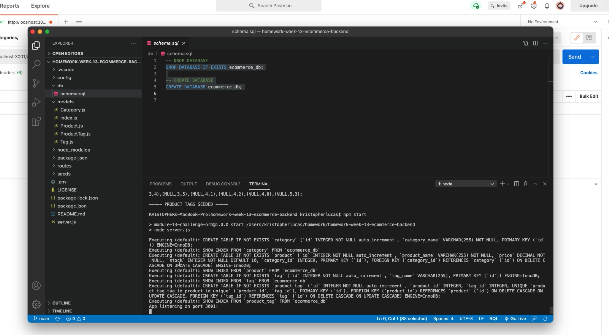
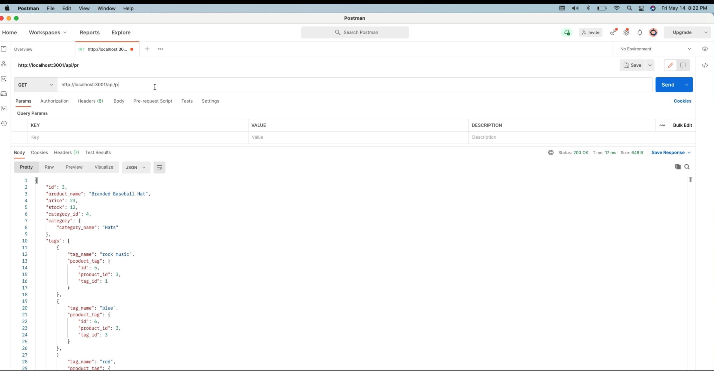

# Homework Week 13 Ecommerce Backend
    
## Table of Contents
* [Description](#description) 
* [Installation](#installation)
* [Usage](#usage)
* [Credits](#credits)
* [License](#license)
* [Badge](#badge)
* [Questions](#questions)
    
## Description
* backend javascript build to demonstrate creation of database, seeding of the database, and using routes to access the database with json information.
    
## Installation
* Whole file directory will need to be loaded into server.  Using npm run seed command to create and seed the database before use.  Once database is created, use npm start command to run program.
    
## Usage
* Using either postman or insomia for route testing, get commands can be used to access the listing of the database, post, put and delete commands are used to update, create or delete items from the database.  These commands are used after the database is seeded per instructions above.

[video 1](https://drive.google.com/file/d/1yK25NoqikpzFEBNv2Rx3lCK3kuiCithv/view)
[video 2](https://drive.google.com/file/d/1_qIpYCy034KRpfELJfaKQoBzBbzzhyCv/view)

## Credits
* N/A
    
## License
* Licensed by mit
    
## Badge
* 
    
## Questions
* For any questions, concerns, or additional help, please contact klucas72@hotmail.com.
